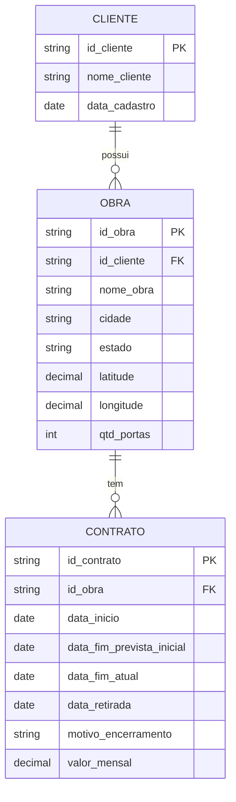

# Modelo de dados — v1.0

> Dados sintéticos. Este documento define as tabelas, colunas, chaves e regras de validação do projeto. Mudanças no modelo começam aqui.

## Escopo do modelo

Três entidades de origem, cada uma recebida como um arquivo CSV: `cliente`, `obra` e `contrato`.

Ficaram **fora** do modelo, por decisão do projeto: oportunidades comerciais, aditivos e medições. A prorrogação de prazo é representada por duas datas no contrato, e a receita é **calculada** a partir dos contratos (ver `regras_de_negocio.md`).

## Diagrama

## Dicionário de dados — origem

### cliente

| Coluna | Tipo | Obrigatória | Descrição |
|---|---|---|---|
| `id_cliente` | texto (`CLI-0001`) | sim | Chave primária |
| `nome_cliente` | texto (120) | sim | Nome fictício do cliente |
| `data_cadastro` | data | sim | Data em que o cliente entrou na base |

### obra

| Coluna | Tipo | Obrigatória | Descrição |
|---|---|---|---|
| `id_obra` | texto (`OBR-0001`) | sim | Chave primária |
| `id_cliente` | texto | sim | Chave estrangeira para `cliente` |
| `nome_obra` | texto (120) | sim | Nome fictício da obra |
| `cidade` | texto (80) | sim | Cidade da obra |
| `estado` | texto (2) | sim | UF da obra |
| `latitude` | decimal (9,6) | sim | Coordenada da obra |
| `longitude` | decimal (9,6) | sim | Coordenada da obra |
| `qtd_portas` | inteiro | sim | Quantidade de portas da obra, maior que zero |

### contrato

| Coluna | Tipo | Obrigatória | Descrição |
|---|---|---|---|
| `id_contrato` | texto (`CTR-0001`) | sim | Chave primária |
| `id_obra` | texto | sim | Chave estrangeira para `obra` |
| `data_inicio` | data | sim | Início da locação |
| `data_fim_prevista_inicial` | data | sim | Prazo assinado originalmente |
| `data_fim_atual` | data | sim | Prazo atual. Igual ao inicial se não houve prorrogação |
| `data_retirada` | data | não | Retirada real da proteção. Vazia enquanto instalada |
| `motivo_encerramento` | texto | condicional | `concluido`, `cancelado_cliente` ou `rescindido`. Obrigatório se há retirada; vazio caso contrário |
| `valor_mensal` | decimal (12,2) | sim | Valor mensal do aluguel, fixo durante o contrato |

## Campos calculados (não existem na origem)

| Campo | Regra |
|---|---|
| `status_contrato` | `encerrado` se há `data_retirada`; senão `ativo` |
| `vencido_em_aberto` | Contrato ativo com `data_fim_atual` anterior à data de referência |
| `prorrogado` | `data_fim_atual` maior que `data_fim_prevista_inicial` |
| `dias_prorrogados` | `data_fim_atual` menos `data_fim_prevista_inicial` |
| `duracao_prevista_dias` | `data_fim_prevista_inicial` menos `data_inicio` |
| `duracao_real_dias` | `data_retirada` menos `data_inicio` (encerrados) |
| `desvio_prazo_dias` | `data_retirada` menos `data_fim_prevista_inicial` (encerrados) |
| `status_obra` | `ativa` se tem ao menos um contrato ativo; senão `encerrada` |
| `receita_mes` | Ver regra de receita em `regras_de_negocio.md` |

## Camadas no MySQL

| Camada | Objetos | Finalidade |
|---|---|---|
| Referência | `ref_cidade`, `ref_parametro` | Cidades (macrorregião e coordenadas) e parâmetros, como a data de referência |
| Staging | `stg_cliente`, `stg_obra`, `stg_contrato` | Cópia fiel dos CSVs em texto, com a linha de origem, `id_execucao` e `carregado_em`. Substituída a cada execução |
| Dimensões | `dim_calendario`, `dim_cliente`, `dim_obra`, `dim_contrato` | Cadastros válidos com tipos reais e restrições. `dim_obra` inclui `macro_regiao` |

| Views | `vw_contrato_mes`, `vw_contrato`, `vw_obra` | `vw_contrato_mes`: um registro por contrato por mês em que esteve ativo, com dias ativos, receita e sinalizadores (tabela de fatos do Power BI). `vw_contrato`: contrato com cliente, obra, vencido em aberto e dias para o vencimento. `vw_obra`: status da obra, carteira ativa e valor por porta |

| Qualidade | `dq_execucao`, `dq_resumo`, `dq_problema` | Histórico das execuções: totais por tabela e cada problema encontrado (rejeições e alertas), com a regra violada |

Em `dim_contrato`, os campos calculados que dependem só da própria linha (status, prorrogado, dias prorrogados, durações e desvio de prazo) são colunas geradas pelo MySQL. O `vencido_em_aberto` e o `status_obra` dependem da data de referência e de outras tabelas, então ficam em views.

## Vencimentos e risco

Calculados pela view `vw_vencimento` (um registro por contrato ativo), a partir da data de referência.

- **Faixas:** `vencido_em_aberto` (prazo passado e proteção instalada), `0-30`, `31-60`, `61-90` e `mais_de_90`. Um contrato que vence na própria data de referência fica em `0-30`.
- **Continuidade do cliente:** o cliente tem outro contrato ativo cujo `data_fim_atual` vai além do deste contrato e da data de referência.
- **Em risco:** contrato nas faixas de 0 a 90 dias e sem continuidade do cliente.
- **Prazo inicial resolvido:** o prazo inicial já venceu, ou o contrato já foi encerrado, ou já foi prorrogado. Contratos ainda dentro do prazo inicial ficam fora da taxa de prorrogação, porque o desfecho deles é desconhecido.
- **Por que a taxa de prorrogação não usa só os encerrados:** contratos prorrogados demoram mais para terminar e ficam sub-representados entre os encerrados, o que subestima a taxa.
- **Receita a vencer esperada** é uma aproximação: aplica a mesma taxa a todos os contratos, inclusive os que já foram prorrogados.

## Decisões de modelagem

1. **Localização só na obra.** O cliente não tem coordenadas nem cidade.
2. **Status derivados.** Status de contrato, obra e prorrogação são calculados, para não contradizerem as datas.
3. **Valor fixo.** `valor_mensal` não muda durante o contrato. A prorrogação altera o prazo, não o preço.
4. **Receita calculada.** Não há tabela de faturamento. A receita mensal é derivada de `valor_mensal` e dos dias ativos.
5. **Chaves.** Texto com prefixo, usadas direto como chave primária, sem chaves artificiais.
6. **Obra com vários contratos.** Contratos da mesma obra podem ser sequenciais ou simultâneos.
7. **Portas na obra.** O valor por porta é calculado no nível da obra: soma do `valor_mensal` dos contratos ativos dividida por `qtd_portas`.
8. **Tipos no banco.** Datas como `DATE`, valores como `DECIMAL`, domínios com restrição `CHECK`.

## Regras de validação (Fase 3)

Tratamento: **rejeita** = o registro vai para `dq_rejeitados` e não segue; **alerta** = segue, mas é registrado.

| ID | Tabela | Regra | Tratamento |
|---|---|---|---|
| R01 | cliente | `id_cliente` obrigatório e único | rejeita |
| R02 | cliente | `nome_cliente` obrigatório | rejeita |
| R03 | cliente | `data_cadastro` válida e não posterior à data de referência | rejeita |
| R04 | obra | `id_obra` obrigatório e único | rejeita |
| R05 | obra | `id_cliente` existe em `cliente` | rejeita |
| R06 | obra | `nome_obra` obrigatório | rejeita |
| R07 | obra | `estado` é uma UF válida | rejeita |
| R08 | obra | latitude e longitude presentes e dentro do Brasil | rejeita |
| R09 | obra | Coordenadas a até 25 km do centro da cidade informada | alerta |
| R10 | obra | `qtd_portas` inteiro maior que zero | rejeita |
| R11 | obra | Obra sem nenhum contrato | alerta |
| R12 | contrato | `id_contrato` obrigatório e único | rejeita |
| R13 | contrato | `id_obra` existe em `obra` | rejeita |
| R14 | contrato | Datas obrigatórias válidas | rejeita |
| R15 | contrato | `data_fim_prevista_inicial` não anterior a `data_inicio` | rejeita |
| R16 | contrato | `data_fim_atual` não anterior a `data_fim_prevista_inicial` | rejeita |
| R17 | contrato | `data_retirada` entre `data_inicio` e a data de referência | rejeita |
| R18 | contrato | `motivo_encerramento` preenchido se e somente se há `data_retirada` | rejeita |
| R19 | contrato | `motivo_encerramento` pertence ao domínio permitido | rejeita |
| R20 | contrato | `valor_mensal` maior que zero | rejeita |
| R21 | contrato | `data_inicio` não posterior à data de referência | rejeita |
| R22 | contrato | `data_inicio` não anterior ao `data_cadastro` do cliente | alerta |
| R23 | contrato | Mesma obra, mesmo início e mesmo valor de outro contrato (possível duplicidade) | alerta |

**Rejeição em cascata:** se um cliente é rejeitado, suas obras são rejeitadas com o motivo "registro pai rejeitado", e o mesmo vale de obra para contratos.

## Limitações

- A receita é calculada, não observada. Análises e previsões sobre ela herdam essa premissa.
- Sem histórico de prorrogações: só o prazo original e o atual.
- O valor por porta pressupõe que os contratos de uma obra, somados, cobrem as portas dela.
- Sem faturamento e pagamento, não há receita recebida nem inadimplência.
- Sem oportunidades, não há conversão nem pipeline.